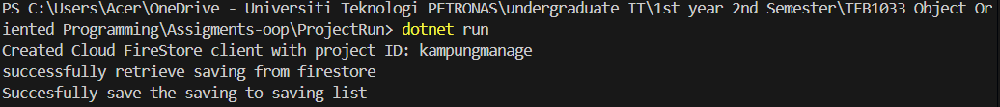
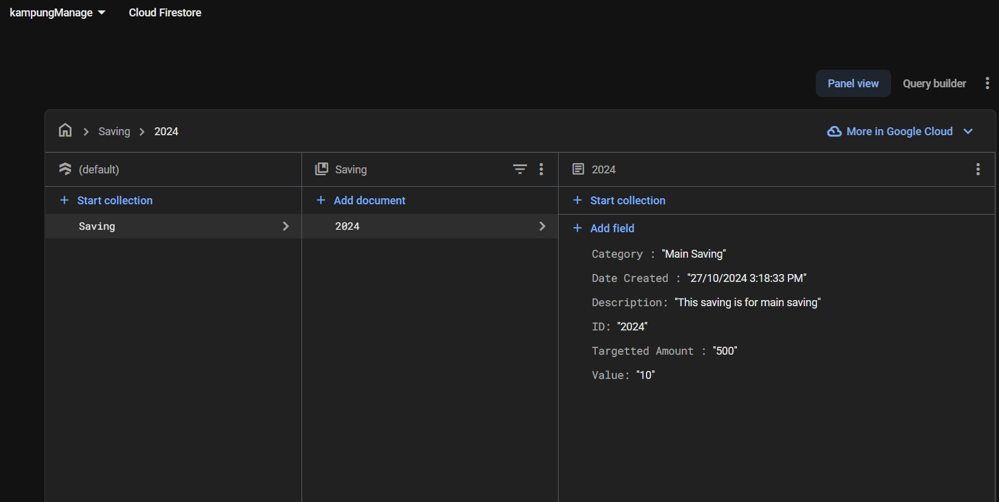

# Homework 3
Write a class to manage saving / restoring data for your app using Firestore database

## ProjectPackage 
This is a package library that store all the related class

### 1) saving.cs 
Pure class for this application '\n'
A class to store a saving information such ID, value, description,date created,  category of the savings and the targetted amount
### 2) savingList.cs
Pure class for this application to store all the savings created for displaying purposes 
Contains saving object 
### 3) process.cs 
This is a class created to group every class that are related to firestore database, isolating the manipulating object and class 
Involved firestore initialization, save the saving info to firestore, and retrieve back savings from the firestore Database 

## ProjectRun
This class was created to test the functionality of the ProjectPackage
### Terminal displaying output connecting and retrieving to the firestore database

### Database after running the code

